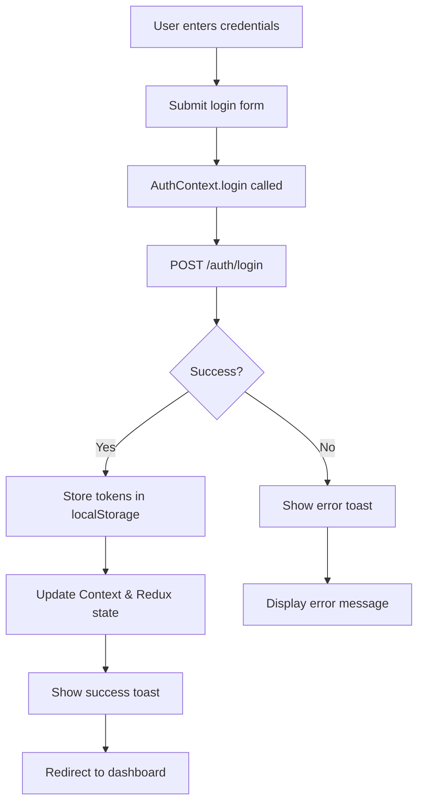
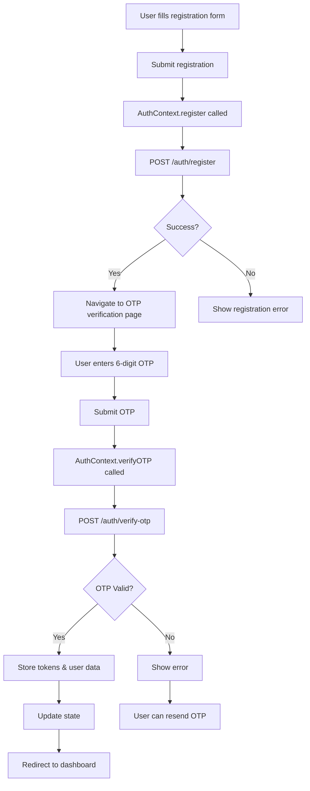
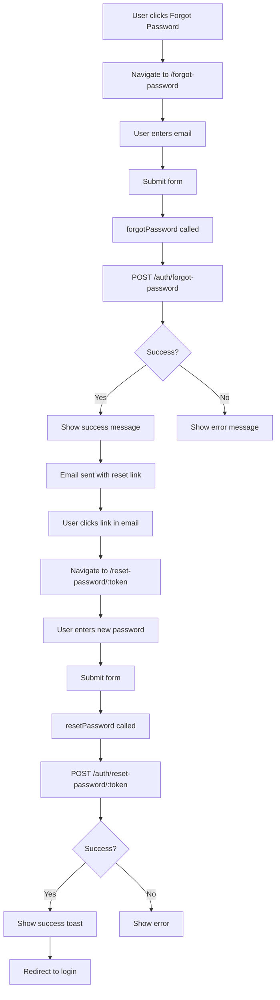
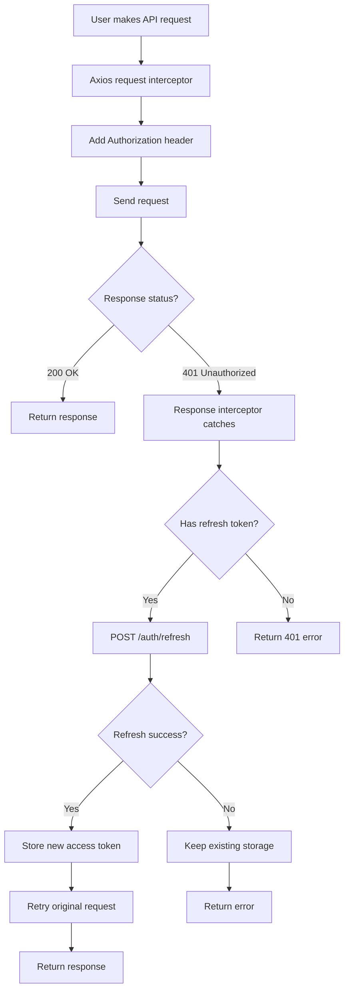

# Admin Authentication Documentation

## Table of Contents
1. [Overview](#overview)
2. [Authentication Architecture](#authentication-architecture)
3. [API Endpoints](#api-endpoints)
4. [Authentication Functions](#authentication-functions)
5. [Pages & Components](#pages--components)
6. [Button Handler & Form Submit Functions](#button-handler--form-submit-functions)
7. [Authentication Flows](#authentication-flows)
8. [Token Management](#token-management)
9. [Error Handling](#error-handling)
10. [State Management](#state-management)

---

## Overview

The admin application uses a JWT (JSON Web Token) based authentication system with the following features:

- **Email/Password Authentication**
- **OTP Email Verification**
- **Google OAuth 2.0** (Web & Mobile)
- **Password Reset Flow**
- **Token Auto-Refresh**
- **Persistent Sessions**
- **Role-Based Access Control**

### Key Technologies
- **Context API**: Global auth state management
- **Redux Toolkit**: Persistent state storage
- **Axios**: HTTP client with interceptors
- **React Router**: Protected route navigation
- **React Hot Toast**: User notifications

---

## Authentication Architecture

### File Structure
```
admin/src/
├── contexts/
│   └── AuthContext.jsx          # Main authentication context
├── pages/auth/
│   ├── Login.jsx                # Login page
│   ├── OTPVerification.jsx      # OTP verification page
│   ├── ForgotPassword.jsx       # Forgot password page
│   ├── ResetPassword.jsx        # Reset password page
│   └── GoogleCallback.jsx       # Google OAuth callback handler
├── utils/
│   └── api.js                   # API client and endpoints
└── store/
    └── slices/authSlice.js      # Redux auth slice
```

### State Management Flow
```
User Action → AuthContext Function → API Call → Update State → UI Update
                                                      ↓
                                              localStorage Update
                                                      ↓
                                              Redux Store Update
```

---

## API Endpoints

### Base URL
```javascript
const API_BASE_URL = 'http://localhost:5000/api'
```

### Auth Endpoints

#### 1. **Login**
- **Endpoint**: `POST /auth/login`
- **Payload**:
  ```javascript
  {
    identifier: "email@example.com",  // Email or phone
    password: "userPassword"
  }
  ```
- **Response**:
  ```javascript
  {
    success: true,
    data: {
      user: { id, firstName, lastName, email, phone, role, isActive },
      accessToken: "eyJhbGc...",
      refreshToken: "eyJhbGc..."
    }
  }
  ```

#### 2. **Register**
- **Endpoint**: `POST /auth/register`
- **Payload**:
  ```javascript
  {
    firstName: "John",
    lastName: "Doe",
    email: "john@example.com",
    phone: "254712345678",
    password: "SecurePass123",
    confirmPassword: "SecurePass123"
  }
  ```
- **Response**:
  ```javascript
  {
    success: true,
    data: {
      message: "Registration successful. Please verify your email.",
      user: { id, email, phone }
    }
  }
  ```

#### 3. **Verify OTP**
- **Endpoint**: `POST /auth/verify-otp`
- **Payload**:
  ```javascript
  {
    email: "john@example.com",
    otp: "123456"
  }
  ```
- **Response**:
  ```javascript
  {
    success: true,
    data: {
      user: { id, firstName, lastName, email, isVerified: true },
      accessToken: "eyJhbGc...",
      refreshToken: "eyJhbGc..."
    }
  }
  ```

#### 4. **Resend OTP**
- **Endpoint**: `POST /auth/resend-otp`
- **Payload**:
  ```javascript
  {
    email: "john@example.com"
  }
  ```
- **Response**:
  ```javascript
  {
    success: true,
    message: "OTP has been resent to your email"
  }
  ```

#### 5. **Forgot Password**
- **Endpoint**: `POST /auth/forgot-password`
- **Payload**:
  ```javascript
  {
    email: "john@example.com"
  }
  ```
- **Response**:
  ```javascript
  {
    success: true,
    message: "Password reset link sent to your email"
  }
  ```

#### 6. **Reset Password**
- **Endpoint**: `POST /auth/reset-password/:token`
- **Payload**:
  ```javascript
  {
    newPassword: "NewSecurePass123"
  }
  ```
- **Response**:
  ```javascript
  {
    success: true,
    message: "Password reset successfully"
  }
  ```

#### 7. **Get Current User**
- **Endpoint**: `GET /auth/me`
- **Headers**: `Authorization: Bearer {accessToken}`
- **Response**:
  ```javascript
  {
    success: true,
    data: {
      user: { id, firstName, lastName, email, phone, role, isActive }
    }
  }
  ```

#### 8. **Logout**
- **Endpoint**: `POST /auth/logout`
- **Headers**: `Authorization: Bearer {accessToken}`
- **Response**:
  ```javascript
  {
    success: true,
    message: "Logged out successfully"
  }
  ```

#### 9. **Refresh Token**
- **Endpoint**: `POST /auth/refresh`
- **Payload**:
  ```javascript
  {
    refreshToken: "eyJhbGc..."
  }
  ```
- **Response**:
  ```javascript
  {
    success: true,
    data: {
      accessToken: "newAccessToken..."
    }
  }
  ```

#### 10. **Google OAuth**
- **Initiate**: `GET /auth/google`
  - Returns: `{ authUrl: "https://accounts.google.com/o/oauth2/v2/auth?..." }`
  
- **Callback**: `POST /auth/google/callback`
  - Payload: `{ code: "oauth_code" }`
  - Response:
    ```javascript
    {
      success: true,
      data: {
        user: { ... },
        tokens: { accessToken, refreshToken }
      }
    }
    ```

- **Mobile/Web (ID Token)**: `POST /auth/google/mobile`
  - Payload: `{ idToken: "google_id_token" }`
  - Response: Same as callback

---

## Authentication Functions

### AuthContext Functions

#### 1. **login(credentials)**
Authenticates user with email/phone and password.

```javascript
const login = async (credentials) => {
  // credentials: { identifier, password }
  // Returns: { success: true/false, error?: string }
}
```

**Usage Example**:
```javascript
const { login } = useAuth()

const handleLogin = async () => {
  const result = await login({
    identifier: "user@example.com",
    password: "password123"
  })
  
  if (result.success) {
    // Redirect to dashboard
  }
}
```

#### 2. **register(userData)**
Registers a new user and sends OTP for verification.

```javascript
const register = async (userData) => {
  // userData: { firstName, lastName, email, phone, password, confirmPassword }
  // Returns: { success: true/false, data?: object, error?: string }
}
```

#### 3. **verifyOTP(otpData)**
Verifies OTP and completes registration.

```javascript
const verifyOTP = async (otpData) => {
  // otpData: { email, otp }
  // Returns: { success: true/false, error?: string }
}
```

#### 4. **resendOTP(emailData)**
Resends OTP to user's email.

```javascript
const resendOTP = async (emailData) => {
  // emailData: { email }
  // Returns: { success: true/false, error?: string }
}
```

#### 5. **forgotPassword(email)**
Initiates password reset flow.

```javascript
const forgotPassword = async (email) => {
  // email: string
  // Returns: { success: true/false, error?: string }
}
```

#### 6. **resetPassword(token, newPassword)**
Resets password using token from email.

```javascript
const resetPassword = async (token, newPassword) => {
  // token: string (from URL)
  // newPassword: string
  // Returns: { success: true/false, error?: string }
}
```

#### 7. **updateProfile(profileData)**
Updates user profile information.

```javascript
const updateProfile = async (profileData) => {
  // profileData: { firstName?, lastName?, phone?, ... }
  // Returns: { success: true, user: updatedUser }
  // Throws error on failure
}
```

#### 8. **changePassword(passwordData)**
Changes user password.

```javascript
const changePassword = async (passwordData) => {
  // passwordData: { currentPassword, newPassword, confirmNewPassword }
  // Returns: { success: true }
  // Throws error on failure
}
```

#### 9. **logout()**
Logs out user and clears all auth data.

```javascript
const logout = async () => {
  // No parameters
  // Clears localStorage and navigates to login
}
```

#### 10. **initiateGoogleAuth()**
Redirects to Google OAuth consent screen.

```javascript
const initiateGoogleAuth = async () => {
  // No parameters
  // Redirects to Google OAuth URL
}
```

#### 11. **handleGoogleCallback(code)**
Handles OAuth callback from Google.

```javascript
const handleGoogleCallback = async (code) => {
  // code: string (from URL query params)
  // Returns: { success: true/false, error?: string }
}
```

#### 12. **googleAuthWithIdToken(idToken)**
Authenticates using Google ID token (for mobile/web).

```javascript
const googleAuthWithIdToken = async (idToken) => {
  // idToken: string (from Google Sign-In)
  // Returns: { success: true/false, error?: string }
}
```

#### 13. **clearError()**
Clears authentication error state.

```javascript
const clearError = () => {
  // No parameters
  // Clears error from state
}
```

### Auth Context State

```javascript
{
  user: {
    id: string,
    firstName: string,
    lastName: string,
    email: string,
    phone: string,
    role: { name: string, permissions: array },
    isActive: boolean,
    isVerified: boolean
  } | null,
  isAuthenticated: boolean,
  isLoading: boolean,
  error: string | null
}
```

---

## Pages & Components

### 1. **Login Page** (`/login`)
**File**: `admin/src/pages/auth/Login.jsx`

**Features**:
- Email/Phone + Password login
- Google OAuth login button
- Apple ID login button (future)
- Instagram login button (future)
- "Forgot Password" link
- "Don't have an account? Sign up" link

**Form Fields**:
```javascript
{
  identifier: "",  // Email or phone
  password: ""
}
```

**Key Functions**:
- `handleSubmit()` - Email/password login
- `handleGoogleLogin()` - Initiates Google OAuth
- `handleInputChange()` - Updates form state
- `handleLoginMethodChange()` - Switches between email/phone

### 2. **OTP Verification Page** (`/otp-verification`)
**File**: `admin/src/pages/auth/OTPVerification.jsx`

**Features**:
- 6-digit OTP input fields
- Auto-focus next input on digit entry
- Resend OTP with 60s cooldown
- Email display
- Back to login option

**State**:
```javascript
{
  otp: ["", "", "", "", "", ""],
  email: "",  // From navigation state
  resendCooldown: 60,
  isResending: false
}
```

**Key Functions**:
- `handleOtpChange(index, value)` - Updates OTP digit
- `handleKeyDown(index, e)` - Handles backspace/arrow keys
- `handleSubmit()` - Verifies OTP
- `handleResendOTP()` - Resends OTP
- `handleBackToLogin()` - Navigates to login

### 3. **Forgot Password Page** (`/forgot-password`)
**File**: `admin/src/pages/auth/ForgotPassword.jsx`

**Features**:
- Email input
- Sends password reset link
- Success state with instructions
- Back to login link

**Form Fields**:
```javascript
{
  email: ""
}
```

**Key Functions**:
- `handleSubmit()` - Sends reset link
- Form validation
- Success/error state management

### 4. **Reset Password Page** (`/reset-password/:token`)
**File**: `admin/src/pages/auth/ResetPassword.jsx`

**Features**:
- New password input with visibility toggle
- Confirm password input
- Password strength indicator
- Password validation
- Success redirect to login

**Form Fields**:
```javascript
{
  newPassword: "",
  confirmPassword: ""
}
```

**State**:
```javascript
{
  showPassword: false,
  showConfirmPassword: false,
  passwordStrength: 0  // 0-4
}
```

**Key Functions**:
- `handleSubmit()` - Resets password
- `handleInputChange()` - Updates form
- `validateForm()` - Validates passwords match
- Password strength calculation

### 5. **Google Callback Page** (`/auth/google/callback`)
**File**: `admin/src/pages/auth/GoogleCallback.jsx`

**Features**:
- Extracts code from URL
- Calls backend to exchange code for tokens
- Shows loading state
- Redirects on success/failure

**Key Functions**:
- `handleCallback()` - Processes OAuth callback
- Automatic redirect to dashboard or login

---

## Button Handler & Form Submit Functions

### Login Page Handlers

#### 1. **handleSubmit() - Login Form Submission**
```javascript
const handleSubmit = async (e) => {
    e.preventDefault()
    setIsLoading(true)
    setError('')
    setValidationErrors({})

    try {
        // Validate form data
        const validationData = {
            ...formData,
            email: formData.loginMethod === 'email' ? formData.email : undefined,
            phone: formData.loginMethod === 'phone' ? formData.phone : undefined
        }
        
        await loginSchema.validate(validationData, { abortEarly: false })

        const credentials = {
            password: formData.password
        }

        if (formData.loginMethod === 'email') {
            credentials.email = formData.email
        } else {
            // Combine country code with phone number
            credentials.phone = countryCode + formData.phone
        }

        const result = await login(credentials)
        
        if (result.success) {
            navigate('/')
        } else {
            setError(result.error)
        }
    } catch (validationError) {
        if (validationError.name === 'ValidationError') {
            const errors = {}
            validationError.inner.forEach((error) => {
                errors[error.path] = error.message
            })
            setValidationErrors(errors)
        } else {
            setError('An unexpected error occurred')
        }
    } finally {
        setIsLoading(false)
    }
}
```

#### 2. **handleGoogleLogin() - Google OAuth Button**
```javascript
const handleGoogleLogin = async () => {
    setIsLoading(true)
    setError('')

    try {
        await initiateGoogleAuth()
        // Note: The page will redirect to Google, so this code won't execute
    } catch (error) {
        console.error('Google login error:', error)
        setError('Failed to initiate Google authentication. Please check your Google OAuth configuration.')
        setIsLoading(false)
    }
}
```

#### 3. **handleAppleLogin() - Apple OAuth Button**
```javascript
const handleAppleLogin = () => {
    console.log('Apple login clicked')
    // TODO: Implement Apple OAuth
}
```

#### 4. **handleInstagramLogin() - Instagram OAuth Button**
```javascript
const handleInstagramLogin = () => {
    console.log('Instagram login clicked')
    // TODO: Implement Instagram OAuth
}
```

#### 5. **handleLoginMethodChange() - Toggle Email/Phone**
```javascript
const handleLoginMethodChange = (method) => {
    setFormData(prev => ({
        ...prev,
        loginMethod: method,
        email: method === 'email' ? prev.email : '',
        phone: method === 'phone' ? prev.phone : ''
    }))
}
```

#### 6. **handleInputChange() - Form Input Handler**
```javascript
const handleInputChange = (e) => {
    const { name, value } = e.target
    setFormData(prev => ({
        ...prev,
        [name]: value
    }))
}
```

### Forgot Password Handlers

#### 1. **handleSubmit() - Forgot Password Form**
```javascript
const handleSubmit = async (e) => {
    e.preventDefault()
    setIsLoading(true)
    setValidationErrors({})

    try {
        // Validate email
        await forgotPasswordSchema.validate({ email }, { abortEarly: false })

        const result = await forgotPassword(email)

        if (result.success) {
            setIsSubmitted(true)
        }
    } catch (validationError) {
        if (validationError.name === 'ValidationError') {
            const errors = {}
            validationError.inner.forEach((error) => {
                errors[error.path] = error.message
            })
            setValidationErrors(errors)
        }
    } finally {
        setIsLoading(false)
    }
}
```

### Reset Password Handlers

#### 1. **handleSubmit() - Reset Password Form**
```javascript
const handleSubmit = async (e) => {
    e.preventDefault()
    setIsLoading(true)
    setValidationErrors({})

    try {
        // Validate form data
        await resetPasswordSchema.validate(formData, { abortEarly: false })

        const result = await resetPassword(token, formData.newPassword)

        if (result.success) {
            setIsSuccess(true)
        }
    } catch (validationError) {
        if (validationError.name === 'ValidationError') {
            const errors = {}
            validationError.inner.forEach((error) => {
                errors[error.path] = error.message
            })
            setValidationErrors(errors)
        }
    } finally {
        setIsLoading(false)
    }
}
```

#### 2. **handleInputChange() - Password Input Handler**
```javascript
const handleInputChange = (e) => {
    const { name, value } = e.target
    setFormData(prev => ({
        ...prev,
        [name]: value
    }))
}
```

### OTP Verification Handlers

#### 1. **handleSubmit() - OTP Verification Form**
```javascript
const handleSubmit = async (e) => {
    e.preventDefault()
    setIsLoading(true)
    setValidationErrors({})

    try {
        const otpString = otp.join('')
        
        // Validate OTP
        await otpSchema.validate({
            otp: otpString,
            email
        }, { abortEarly: false })

        const result = await verifyOTP({
            email,
            otp: otpString
        })

        if (result.success) {
            localStorage.removeItem('pendingEmail')
            navigate('/dashboard')
        }
    } catch (validationError) {
        if (validationError.name === 'ValidationError') {
            const errors = {}
            validationError.inner.forEach((error) => {
                errors[error.path] = error.message
            })
            setValidationErrors(errors)
        }
    } finally {
        setIsLoading(false)
    }
}
```

#### 2. **handleOtpChange() - OTP Input Handler**
```javascript
const handleOtpChange = (index, value) => {
    if (value.length > 1) return // Only allow single digit
    
    const newOtp = [...otp]
    newOtp[index] = value
    setOtp(newOtp)

    // Auto-focus next input
    if (value && index < 5) {
        const nextInput = document.getElementById(`otp-${index + 1}`)
        if (nextInput) nextInput.focus()
    }
}
```

#### 3. **handleKeyDown() - OTP Backspace Navigation**
```javascript
const handleKeyDown = (index, e) => {
    // Handle backspace
    if (e.key === 'Backspace' && !otp[index] && index > 0) {
        const prevInput = document.getElementById(`otp-${index - 1}`)
        if (prevInput) prevInput.focus()
    }
}
```

#### 4. **handleResendOTP() - Resend OTP Button**
```javascript
const handleResendOTP = async () => {
    setResendLoading(true)
    
    const result = await resendOTP({ email })
    
    if (result.success) {
        setCountdown(60) // 60 seconds countdown
    }
    
    setResendLoading(false)
}
```

#### 5. **handleBackToLogin() - Back Button Navigation**
```javascript
const handleBackToLogin = () => {
    localStorage.removeItem('pendingEmail')
    navigate('/login')
}
```

### Google Callback Handlers

#### 1. **handleCallback() - Process OAuth Callback**
```javascript
const handleCallback = async () => {
    try {
        console.log('Google callback initiated')
        console.log('Search params:', Object.fromEntries(searchParams.entries()))

        const code = searchParams.get('code')
        const error = searchParams.get('error')
        const state = searchParams.get('state')

        console.log('OAuth callback details:', { code: !!code, error, state })

        if (error) {
            console.error('OAuth error received:', error)
            setError(`Authentication failed: ${error}`)
            setIsLoading(false)
            return
        }

        if (!code) {
            console.error('No authorization code received')
            setError('No authorization code received from Google')
            setIsLoading(false)
            return
        }

        console.log('Processing authorization code...')
        const result = await handleGoogleCallback(code)

        if (result.success) {
            navigate('/', { replace: true })
        } else {
            setError(result.error || 'Authentication failed')
        }
    } catch (err) {
        console.error('Google callback error:', err)
        setError('Authentication failed. Please try again.')
    } finally {
        setIsLoading(false)
    }
}
```

**Note**: This function runs automatically on component mount via `useEffect` and extracts the OAuth code from URL parameters to complete the authentication flow.

### AuthContext Functions (Backend Integration)

#### 1. **login() - Main Login Function**
```javascript
const login = async (credentials) => {
    dispatch({ type: AUTH_ACTIONS.LOGIN_START })
    reduxDispatch(setAuthLoading(true))
    
    try {
        const response = await authAPI.login(credentials)
        const { user, accessToken, refreshToken } = response.data.data

        // Store tokens and user data
        localStorage.setItem('accessToken', accessToken)
        localStorage.setItem('refreshToken', refreshToken)
        localStorage.setItem('user', JSON.stringify(user))

        dispatch({
            type: AUTH_ACTIONS.LOGIN_SUCCESS,
            payload: { user }
        })
        reduxDispatch(setAuthSuccess(user))

        toast.success('Login successful!')
        return { success: true }
        
    } catch (error) {
        const errorMessage = error?.response?.data?.message || error?.message || 'Login failed'
        dispatch({
            type: AUTH_ACTIONS.LOGIN_FAILURE,
            payload: errorMessage
        })
        reduxDispatch(setAuthFailure(errorMessage))
        toast.error(errorMessage)
        return { success: false, error: errorMessage }
    }
}
```

#### 2. **forgotPassword() - Forgot Password Function**
```javascript
const forgotPassword = async (email) => {
    try {
        await authAPI.forgotPassword(email)
        toast.success('Password reset instructions sent to your email!')
        return { success: true }
    } catch (error) {
        const errorMessage = error.response?.data?.message || 'Failed to send reset email'
        toast.error(errorMessage)
        return { success: false, error: errorMessage }
    }
}
```

#### 3. **resetPassword() - Reset Password Function**
```javascript
const resetPassword = async (token, newPassword) => {
    try {
        await authAPI.resetPassword(token, newPassword)
        toast.success('Password reset successfully!')
        return { success: true }
    } catch (error) {
        const errorMessage = error.response?.data?.message || 'Failed to reset password'
        toast.error(errorMessage)
        return { success: false, error: errorMessage }
    }
}
```

#### 4. **verifyOTP() - OTP Verification Function**
```javascript
const verifyOTP = async (otpData) => {
    dispatch({ type: AUTH_ACTIONS.LOGIN_START })
    reduxDispatch(setAuthLoading(true))

    try {
        const response = await authAPI.verifyOTP(otpData)
        const { user, accessToken, refreshToken } = response.data.data

        // Store tokens and user data
        localStorage.setItem('accessToken', accessToken)
        localStorage.setItem('refreshToken', refreshToken)
        localStorage.setItem('user', JSON.stringify(user))

        dispatch({
            type: AUTH_ACTIONS.LOGIN_SUCCESS,
            payload: { user }
        })
        reduxDispatch(setAuthSuccess(user))

        toast.success('Email verified successfully!')
        return { success: true }
    } catch (error) {
        const errorMessage = error.response?.data?.message || 'OTP verification failed'
        dispatch({
            type: AUTH_ACTIONS.LOGIN_FAILURE,
            payload: errorMessage
        })
        reduxDispatch(setAuthFailure(errorMessage))
        toast.error(errorMessage)
        return { success: false, error: errorMessage }
    }
}
```

#### 5. **resendOTP() - Resend OTP Function**
```javascript
const resendOTP = async (emailData) => {
    try {
        await authAPI.resendOTP(emailData)
        toast.success('OTP has been resent to your email!')
        return { success: true }
    } catch (error) {
        const errorMessage = error.response?.data?.message || 'Failed to resend OTP'
        toast.error(errorMessage)
        return { success: false, error: errorMessage }
    }
}
```

#### 6. **initiateGoogleAuth() - Start Google OAuth Flow**
```javascript
const initiateGoogleAuth = async () => {
    try {
        const response = await authAPI.getGoogleAuthUrl()
        const authUrl = response.data.data.authUrl

        // Open Google OAuth in a popup or redirect
        window.location.href = authUrl
    } catch (error) {
        const errorMessage = error.response?.data?.message || 'Failed to initiate Google authentication'
        toast.error(errorMessage)
        throw error
    }
}
```

#### 7. **handleGoogleCallback() - Process Google OAuth Callback**
```javascript
const handleGoogleCallback = async (code) => {
    dispatch({ type: AUTH_ACTIONS.LOGIN_START })
    reduxDispatch(setAuthLoading(true))

    try {
        const response = await authAPI.googleAuthCallback({ code })
        const { user, tokens } = response.data.data

        // Store tokens and user data
        localStorage.setItem('accessToken', tokens.accessToken)
        localStorage.setItem('refreshToken', tokens.refreshToken)
        localStorage.setItem('user', JSON.stringify(user))

        dispatch({
            type: AUTH_ACTIONS.LOGIN_SUCCESS,
            payload: { user }
        })
        reduxDispatch(setAuthSuccess(user))

        toast.success('Google authentication successful!')
        return { success: true }
    } catch (error) {
        const errorMessage = error.response?.data?.message || 'Google authentication failed'
        dispatch({
            type: AUTH_ACTIONS.LOGIN_FAILURE,
            payload: errorMessage
        })
        reduxDispatch(setAuthFailure(errorMessage))
        toast.error(errorMessage)
        return { success: false, error: errorMessage }
    }
}
```

#### 8. **googleAuthWithIdToken() - Google Auth with ID Token (Mobile/Web)**
```javascript
const googleAuthWithIdToken = async (idToken) => {
    dispatch({ type: AUTH_ACTIONS.LOGIN_START })
    reduxDispatch(setAuthLoading(true))

    try {
        const response = await authAPI.googleAuthMobile({ idToken })
        const { user, tokens } = response.data.data

        // Store tokens and user data
        localStorage.setItem('accessToken', tokens.accessToken)
        localStorage.setItem('refreshToken', tokens.refreshToken)
        localStorage.setItem('user', JSON.stringify(user))

        dispatch({
            type: AUTH_ACTIONS.LOGIN_SUCCESS,
            payload: { user }
        })
        reduxDispatch(setAuthSuccess(user))

        toast.success('Google authentication successful!')
        return { success: true }
    } catch (error) {
        const errorMessage = error.response?.data?.message || 'Google authentication failed'
        dispatch({
            type: AUTH_ACTIONS.LOGIN_FAILURE,
            payload: errorMessage
        })
        reduxDispatch(setAuthFailure(errorMessage))
        toast.error(errorMessage)
        return { success: false, error: errorMessage }
    }
}
```

### Practical Usage - Attaching Handlers to Buttons & Forms

#### Login Form Example
```jsx
{/* Login Form with onSubmit handler */}
<form className="space-y-6" onSubmit={handleSubmit}>
    
    {/* Email/Phone Input Field */}
    <input
        id="email"
        name="email"
        type="email"
        required
        className="input pl-10"
        placeholder="Enter your email"
        value={formData.email}
        onChange={handleInputChange}
    />

    {/* Password Input Field */}
    <input
        id="password"
        name="password"
        type={showPassword ? 'text' : 'password'}
        required
        className="input pl-10 pr-10"
        placeholder="Enter your password"
        value={formData.password}
        onChange={handleInputChange}
    />

    {/* Submit Button */}
    <button
        type="submit"
        disabled={isLoading}
        className="btn-primary w-full disabled:opacity-50 disabled:cursor-not-allowed"
    >
        {isLoading ? (
            <div className="flex items-center justify-center">
                <div className="animate-spin rounded-full h-4 w-4 border-b-2 border-white mr-2"></div>
                Signing in...
            </div>
        ) : (
            'Sign in'
        )}
    </button>
</form>

{/* Google Login Button with onClick handler */}
<button
    onClick={handleGoogleLogin}
    className="w-full flex items-center justify-center px-4 py-3 border border-gray-300 rounded-lg shadow-sm bg-white text-gray-700 hover:bg-gray-50"
>
    <FcGoogle className="w-5 h-5 mr-3" />
    <span className="font-medium">Continue with Google</span>
</button>

{/* Password Visibility Toggle Button */}
<button
    type="button"
    onClick={() => setShowPassword(!showPassword)}
    className="text-primary hover:text-secondary transition-colors"
>
    {showPassword ? <FiEyeOff className="h-5 w-5" /> : <FiEye className="h-5 w-5" />}
</button>
```

#### OTP Verification Example
```jsx
{/* OTP Form with onSubmit handler */}
<form className="space-y-6" onSubmit={handleSubmit}>
    
    {/* OTP Input Fields with onChange and onKeyDown */}
    <div className="flex justify-between space-x-2">
        {otp.map((digit, index) => (
            <input
                key={index}
                id={`otp-${index}`}
                type="text"
                maxLength="1"
                value={digit}
                onChange={(e) => handleOtpChange(index, e.target.value)}
                onKeyDown={(e) => handleKeyDown(index, e)}
                className="w-12 h-12 text-center text-lg font-semibold border border-gray-300 rounded-lg"
                placeholder="0"
            />
        ))}
    </div>

    {/* Verify Button */}
    <button
        type="submit"
        disabled={isLoading || otp.join('').length !== 6}
        className="btn-primary w-full"
    >
        {isLoading ? 'Verifying...' : 'Verify Email'}
    </button>

    {/* Resend OTP Button with onClick handler */}
    <button
        type="button"
        onClick={handleResendOTP}
        disabled={resendLoading || countdown > 0}
        className="mt-2 text-sm font-medium text-primary hover:text-secondary"
    >
        {resendLoading ? 'Sending...' : countdown > 0 ? `Resend in ${countdown}s` : 'Resend code'}
    </button>
</form>
```

#### Forgot Password Example
```jsx
{/* Forgot Password Form with onSubmit handler */}
<form className="space-y-6" onSubmit={handleSubmit}>
    
    {/* Email Input */}
    <input
        id="email"
        name="email"
        type="email"
        required
        className="input pl-10"
        placeholder="Enter your email address"
        value={email}
        onChange={(e) => setEmail(e.target.value)}
    />

    {/* Submit Button */}
    <button
        type="submit"
        disabled={isLoading || !email}
        className="btn-primary w-full"
    >
        {isLoading ? (
            <div className="flex items-center justify-center">
                <div className="animate-spin rounded-full h-4 w-4 border-b-2 border-white mr-2"></div>
                Sending...
            </div>
        ) : (
            'Send reset instructions'
        )}
    </button>
</form>
```

#### Reset Password Example
```jsx
{/* Reset Password Form with onSubmit handler */}
<form className="space-y-6" onSubmit={handleSubmit}>
    
    {/* New Password Input */}
    <input
        id="newPassword"
        name="newPassword"
        type={showPassword ? 'text' : 'password'}
        required
        className="input pl-10 pr-10"
        placeholder="Enter new password"
        value={formData.newPassword}
        onChange={handleInputChange}
    />

    {/* Confirm Password Input */}
    <input
        id="confirmPassword"
        name="confirmPassword"
        type={showConfirmPassword ? 'text' : 'password'}
        required
        className="input pl-10 pr-10"
        placeholder="Confirm new password"
        value={formData.confirmPassword}
        onChange={handleInputChange}
    />

    {/* Submit Button */}
    <button
        type="submit"
        disabled={isLoading || !formData.newPassword || !formData.confirmPassword || formData.newPassword !== formData.confirmPassword}
        className="btn-primary w-full"
    >
        {isLoading ? 'Resetting...' : 'Reset Password'}
    </button>
</form>
```

---

## Authentication Flows

### 1. Email/Password Login Flow



**Step-by-Step**:
1. User fills in login form (`identifier`, `password`)
2. User clicks "Login" button
3. `handleSubmit()` calls `login()` from AuthContext
4. API call: `POST /auth/login` with credentials
5. On success:
   - Store `accessToken`, `refreshToken`, `user` in localStorage
   - Update React Context state
   - Update Redux store
   - Show success toast
   - Navigate to `/` (dashboard)
6. On failure:
   - Show error toast with specific message
   - Display error in UI

### 2. Registration & OTP Verification Flow



**Step-by-Step**:
1. User fills registration form with all required fields
2. User submits form
3. `register()` called with user data
4. API call: `POST /auth/register`
5. On success:
   - Navigate to `/otp-verification` with email in state
   - OTP sent to user's email
6. User enters 6-digit OTP
7. `verifyOTP()` called with email and OTP
8. API call: `POST /auth/verify-otp`
9. On OTP verification success:
   - Tokens stored in localStorage
   - State updated
   - Navigate to dashboard
10. If OTP wrong/expired:
    - Show error
    - User can click "Resend OTP"

### 3. Google OAuth Flow

```mermaid
graph TD
    A[User clicks Google Login] --> B[initiateGoogleAuth called]
    B --> C[GET /auth/google]
    C --> D[Redirect to Google OAuth consent]
    D --> E[User grants permission]
    E --> F[Google redirects to callback URL]
    F --> G[/auth/google/callback?code=xxx]
    G --> H[Extract code from URL]
    H --> I[handleGoogleCallback called]
    I --> J[POST /auth/google/callback]
    J --> K{Success?}
    K -->|Yes| L[Store tokens & user]
    L --> M[Update state]
    M --> N[Redirect to dashboard]
    K -->|No| O[Show error & redirect to login]
```

**Alternative: ID Token Flow (Mobile/Web)**:
1. User clicks Google Login
2. Google Sign-In SDK returns ID token
3. `googleAuthWithIdToken(idToken)` called
4. API call: `POST /auth/google/mobile` with idToken
5. Backend verifies token with Google
6. Returns user & tokens
7. Store and redirect to dashboard

### 4. Forgot Password Flow



### 5. Token Auto-Refresh Flow



**Implementation Details**:
- Axios response interceptor catches 401 errors
- Checks if `refreshToken` exists in localStorage
- Calls `/auth/refresh` to get new `accessToken`
- Updates localStorage with new token
- Retries original request with new token
- On refresh failure, keeps existing storage (allows manual retry)

---

## Token Management

### Token Storage
Tokens are stored in browser's `localStorage`:

```javascript
// Stored items
localStorage.setItem('accessToken', token)
localStorage.setItem('refreshToken', token)
localStorage.setItem('user', JSON.stringify(userData))
```

### Token Lifecycle

1. **On Login/Registration Success**:
   - `accessToken` and `refreshToken` stored
   - User object stored
   - Redux state updated

2. **On Every Request**:
   - Request interceptor adds: `Authorization: Bearer {accessToken}`

3. **On 401 Response**:
   - Response interceptor attempts token refresh
   - New `accessToken` stored
   - Original request retried

4. **On Logout**:
   - All tokens removed from localStorage
   - Redux state cleared
   - Redirect to login

### Token Security

- **Access Token**: Short-lived (15 minutes typical)
- **Refresh Token**: Long-lived (7 days typical)
- **HttpOnly Cookies**: Not used (tokens in localStorage for SPA)
- **HTTPS Required**: Production should use HTTPS only

### Session Persistence

On app load:
```javascript
useEffect(() => {
  const token = localStorage.getItem('accessToken')
  const user = localStorage.getItem('user')
  
  if (token && user) {
    // Rehydrate state from localStorage
    dispatch(setAuthSuccess(JSON.parse(user)))
    
    // Background validation
    authAPI.getMe()
      .then(response => {
        // Update with latest user data
        updateUser(response.data.data.user)
      })
      .catch(() => {
        // Keep cached state, allow manual action
      })
  }
}, [])
```

---

## Error Handling

### Error Types

#### 1. **Network Errors**
```javascript
// No response from server
{
  message: "Network Error",
  // No error.response
}
```

**Handling**:
```javascript
try {
  await login(credentials)
} catch (error) {
  if (!error.response) {
    toast.error("Network error. Please check your connection.")
  }
}
```

#### 2. **Validation Errors** (400)
```javascript
{
  response: {
    status: 400,
    data: {
      success: false,
      message: "Validation failed",
      errors: {
        email: "Invalid email format",
        password: "Password must be at least 8 characters"
      }
    }
  }
}
```

#### 3. **Authentication Errors** (401)
```javascript
{
  response: {
    status: 401,
    data: {
      success: false,
      message: "Invalid credentials"
    }
  }
}
```

#### 4. **Authorization Errors** (403)
```javascript
{
  response: {
    status: 403,
    data: {
      success: false,
      message: "You don't have permission to access this resource"
    }
  }
}
```

#### 5. **Server Errors** (500)
```javascript
{
  response: {
    status: 500,
    data: {
      success: false,
      message: "Internal server error"
    }
  }
}
```

### Error Display Strategy

1. **Toast Notifications**: For all auth operations
   ```javascript
   toast.error(error.response?.data?.message || "Operation failed")
   toast.success("Operation successful!")
   ```

2. **Inline Errors**: For form validation
   ```javascript
   {error && (
     <p className="text-red-500 text-sm mt-1">{error}</p>
   )}
   ```

3. **Error State in Context**: Global error tracking
   ```javascript
   const { error, clearError } = useAuth()
   
   useEffect(() => {
     if (error) {
       // Display error
       setTimeout(clearError, 5000) // Auto-clear
     }
   }, [error])
   ```

---

## State Management

### Redux Store Structure

```javascript
// auth slice
{
  auth: {
    user: {
      id: "...",
      firstName: "John",
      lastName: "Doe",
      email: "john@example.com",
      phone: "254712345678",
      role: {
        name: "Admin",
        permissions: ["read:users", "write:products"]
      },
      isActive: true,
      isVerified: true
    },
    isAuthenticated: true,
    isLoading: false,
    error: null
  }
}
```

### Redux Actions

1. **setAuthLoading(boolean)**
   ```javascript
   dispatch(setAuthLoading(true))
   ```

2. **setAuthSuccess(user)**
   ```javascript
   dispatch(setAuthSuccess(userData))
   ```

3. **setAuthFailure(errorMessage)**
   ```javascript
   dispatch(setAuthFailure("Login failed"))
   ```

4. **clearAuth()**
   ```javascript
   dispatch(clearAuth())
   ```

### Context + Redux Sync

The app uses both Context API and Redux:

- **Context**: Provides auth functions and real-time state
- **Redux**: Persists state across page refreshes

**Sync Flow**:
```javascript
// On login success
dispatch({ type: AUTH_ACTIONS.LOGIN_SUCCESS, payload: { user } })  // Context
reduxDispatch(setAuthSuccess(user))  // Redux
localStorage.setItem('user', JSON.stringify(user))  // Storage
```

---

## Protected Routes

### Implementation

```javascript
// App.jsx
const Layout = () => {
  const { isAuthenticated, isLoading } = useAuth()

  if (isLoading) {
    return <LoadingSpinner />
  }

  return isAuthenticated ? (
    <div>
      <Header />
      <Sidebar />
      <Outlet />
    </div>
  ) : (
    <Navigate to="/login" replace />
  )
}

// Routes
<Route element={<Layout />}>
  <Route path="/" element={<Dashboard />} />
  <Route path="/products" element={<Products />} />
  {/* ... other protected routes */}
</Route>
```

### Role-Based Access

**Check user role**:
```javascript
const { user } = useAuth()

if (user?.role?.name === 'Admin') {
  // Show admin features
}

if (user?.role?.permissions?.includes('write:products')) {
  // Allow product creation
}
```

---

## Best Practices

### 1. **Always Check Auth State**
```javascript
const { isAuthenticated, isLoading } = useAuth()

if (isLoading) return <Spinner />
if (!isAuthenticated) return <Navigate to="/login" />

return <ProtectedContent />
```

### 2. **Handle Errors Gracefully**
```javascript
try {
  await login(credentials)
} catch (error) {
  const message = error.response?.data?.message || "Login failed"
  toast.error(message)
  // Allow user to retry
}
```

### 3. **Clear Sensitive Data on Logout**
```javascript
const logout = async () => {
  try {
    await authAPI.logout()
  } finally {
    localStorage.clear()  // Remove all auth data
    navigate('/login')
  }
}
```

### 4. **Validate Input Client-Side**
```javascript
const validateEmail = (email) => {
  return /^[^\s@]+@[^\s@]+\.[^\s@]+$/.test(email)
}

const validatePassword = (password) => {
  return password.length >= 8
}
```

### 5. **Use Loading States**
```javascript
const [isLoggingIn, setIsLoggingIn] = useState(false)

const handleLogin = async () => {
  setIsLoggingIn(true)
  try {
    await login(credentials)
  } finally {
    setIsLoggingIn(false)
  }
}
```

---

## Security Considerations

1. **Token Storage**: Tokens in localStorage (XSS vulnerable but necessary for SPA)
2. **HTTPS Only**: Always use HTTPS in production
3. **Token Expiry**: Access tokens expire, refresh tokens have longer life
4. **CORS**: Backend configured with allowed origins
5. **Password Strength**: Enforce strong passwords (8+ chars, numbers, symbols)
6. **Rate Limiting**: Backend should rate-limit auth endpoints
7. **OTP Expiry**: OTPs expire after 10 minutes
8. **No Sensitive Data in URLs**: Use POST for credentials, never GET

---

## Troubleshooting

### Issue: "Invalid token" on page refresh
**Solution**: Token might be expired. Refresh token flow should auto-handle, but if it fails:
```javascript
// Manually retry
localStorage.removeItem('accessToken')
await authAPI.getMe()  // Will trigger refresh
```

### Issue: Google OAuth not working
**Solution**: 
1. Check `VITE_GOOGLE_CLIENT_ID` in `.env`
2. Ensure redirect URI matches Google Console settings
3. Check backend Google OAuth configuration

### Issue: OTP not received
**Solution**:
1. Check email service configuration in backend
2. Verify email is not in spam
3. Use "Resend OTP" after 60 seconds

### Issue: Infinite redirect loop
**Solution**:
1. Check `isLoading` state - should become `false` after initialization
2. Verify token exists in localStorage
3. Check backend `/auth/me` endpoint returns valid user

---

## Quick Reference

### Auth Hook Usage
```javascript
import { useAuth } from '@/contexts/AuthContext'

const MyComponent = () => {
  const { 
    user,              // Current user object
    isAuthenticated,   // Boolean
    isLoading,         // Boolean
    error,             // String | null
    login,             // Function
    logout,            // Function
    // ... other functions
  } = useAuth()
  
  return (
    // Your component JSX
  )
}
```

### API Error Response Format
```javascript
{
  success: false,
  message: "Error message",
  errors?: {         // Validation errors
    field: "error"
  }
}
```

### API Success Response Format
```javascript
{
  success: true,
  data: {
    // Response data
  }
}
```

---

**Last Updated**: October 14, 2025  
**Version**: 1.0.0  
**Maintained By**: TEO KICKS Development Team

